# Convertidor de M4A y Opus a MP3

Este es un script en Batch para Windows que convierte automáticamente todos los archivos de audio en formato M4A y Opus de una carpeta a formato MP3 utilizando FFmpeg. El script te permite seleccionar la carpeta de origen (donde están los archivos M4A y Opus) y la carpeta de destino (donde se guardarán los archivos convertidos). Si la carpeta de origen está vacía o no se selecciona una carpeta, el script muestra mensajes de error en ventanas emergentes.

## Características

- Convierte automáticamente todos los archivos M4A y Opus en una carpeta a MP3.
- Interfaz gráfica para seleccionar carpetas de origen y destino.
- Muestra mensajes de error en ventanas emergentes si hay problemas durante el proceso.
- Utiliza FFmpeg para la conversión, garantizando alta calidad de audio.

## Requisitos

- [FFmpeg](https://ffmpeg.org/download.html) instalado y configurado en el sistema.
- Windows 7 o superior.


- [FFmpeg](https://phoenixnap.com/kb/ffmpeg-windows) Guia de phoenixnap.com (Solo la traduci).
## Instalación de FFmpeg en Windows

Para instalar FFmpeg en Windows, es necesario agregar la utilidad a la variable de entorno PATH. A continuación, te explicamos cómo hacerlo:

### Paso 1: Descargar FFmpeg para Windows

1. Visita la [página de descargas de FFmpeg](https://ffmpeg.org/download.html).
2. En la sección **More downloading options**, encuentra el enlace `Windows builds from gyan.dev` y haz clic en él.
   
   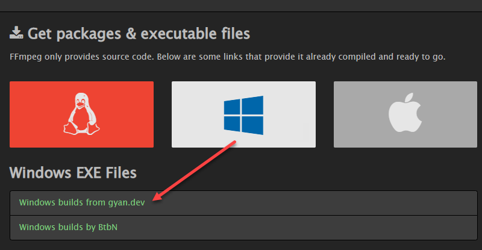
   
3. En la sección **git master builds**, busca la última versión de la compilación de FFmpeg y haz clic en el enlace `ffmpeg-git-full-7z` para descargar la versión completa.
     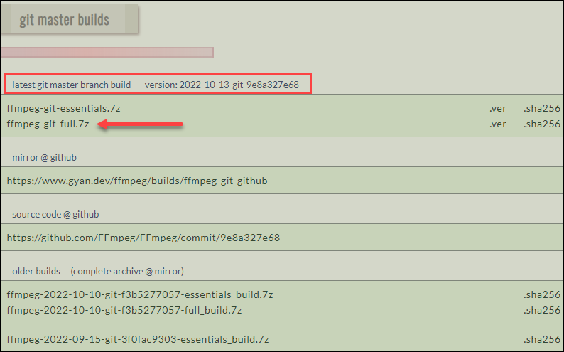  
4. Elige la ubicación de la descarga y guarda el archivo si no comienza automáticamente.

### Paso 2: Extraer los archivos descargados

1. Localiza el archivo descargado en la carpeta de descargas.
2. Haz clic derecho en el archivo y selecciona **7-Zip > Extract here** (o usa el descompresor de tu preferencia).
   
   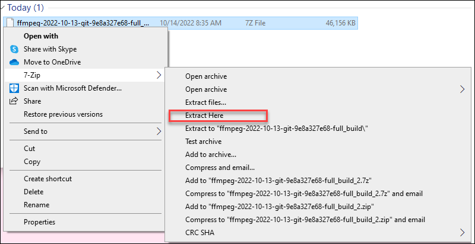
   
3. Renombra la carpeta extraída a `ffmpeg`.
   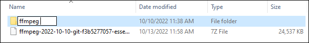
4. Mueve la carpeta `ffmpeg` al directorio raíz del disco C: o a la carpeta de tu elección.
   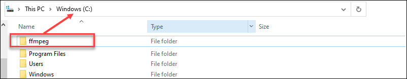

### Paso 3: Agregar FFmpeg a PATH

1. Escribe `system variables` en la barra de búsqueda de Windows y selecciona **Edit the system environment variables**.
   
   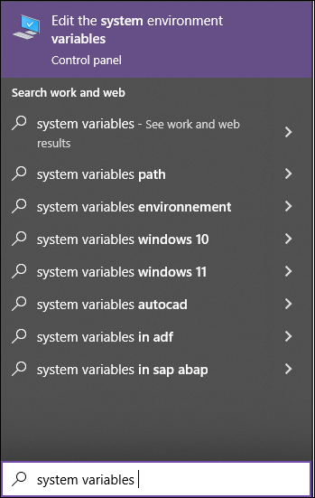
   
2. En la sección **User variables**, selecciona `Path` y haz clic en el botón **Edit**.
   
   
   
3. Haz clic en **New** y añade `C:\ffmpeg\bin` en el campo vacío.

  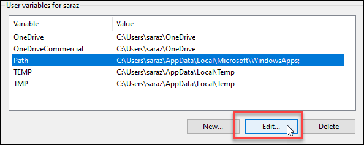

4. Confirma los cambios con **OK**.

   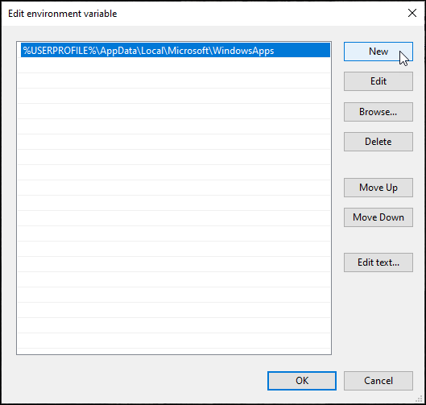
   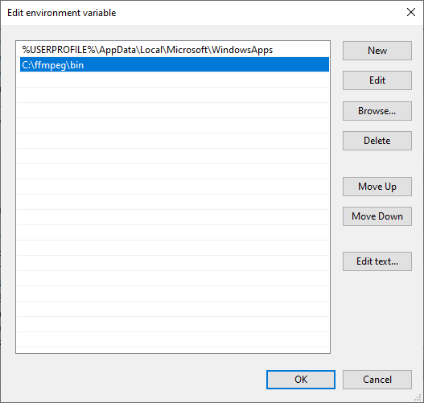
   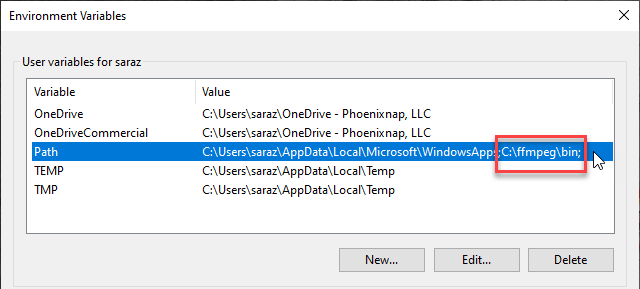
   
### Paso 4: Verificar la instalación de FFmpeg

Para verificar que FFmpeg se ha agregado correctamente a la variable de entorno PATH, abre el **Command Prompt** o **PowerShell** y ejecuta:

```bash
ffmpeg
```

Deberías ver una salida similar a la siguiente, confirmando que FFmpeg está instalado:

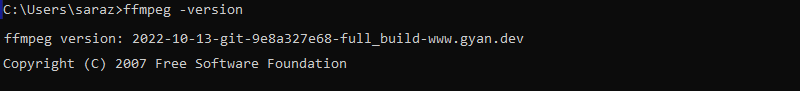


Uso del Script:

1.Clona o descarga este repositorio en tu máquina local.

2.Asegúrate de que FFmpeg esté instalado y agregado al PATH.

3.Ejecuta el archivo convertir_a_mp3.bat y sigue las instrucciones en pantalla para seleccionar las carpetas de origen y destino.

4.El script convertirá automáticamente todos los archivos M4A y Opus en la carpeta de origen a formato MP3.

Licencia
Este proyecto está licenciado bajo la Licencia MIT. Consulta el archivo LICENSE para más detalles.
